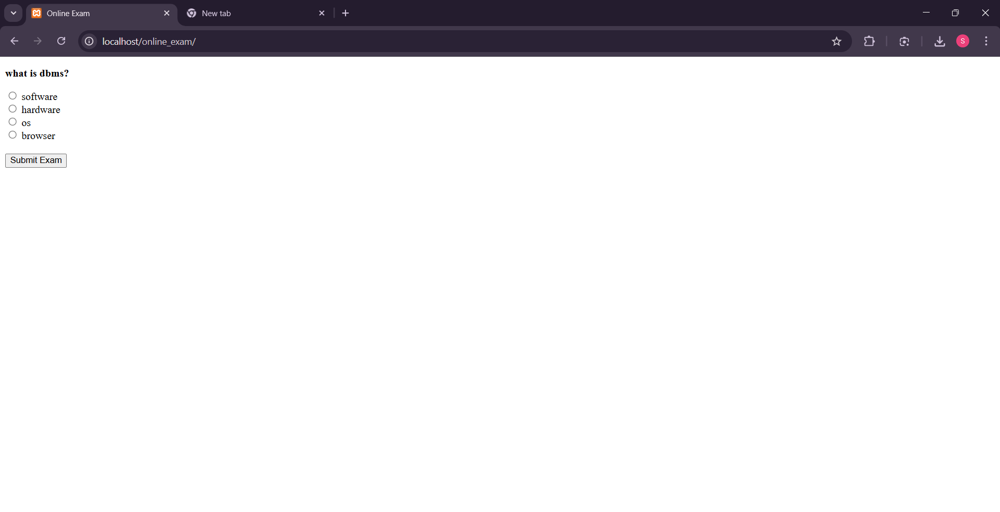
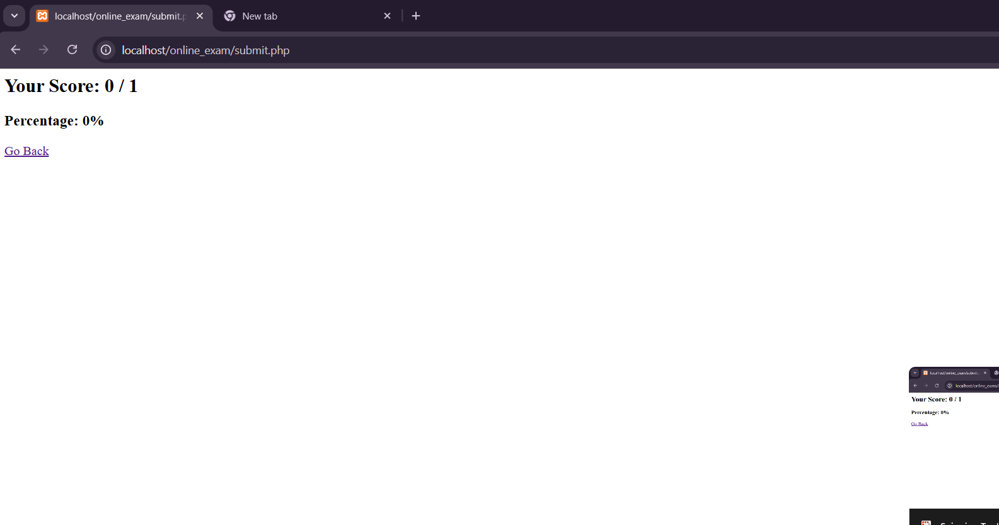

# Student Examination System

A web-based application for conducting online examinations.  
Students can answer questions and view their results automatically after submission.

## Features
- Online exam interface
- Multiple choice question submission
- Automatic score calculation
- Result display after exam completion

## Tech Stack
- PHP
- MySQL
- HTML
- CSS
- XAMPP

## Project Structure
student-examination-system
│
├── admin.php
├── db.php
├── exam.php
├── index.php
├── result.php
├── submit.php
├── online.sql
└── screenshots

## How to Run the Project

1. Install XAMPP.
2. Copy the project folder into:
  xampp/htdocs/

3. Start Apache and MySQL in XAMPP.
4. Import the `online.sql` file into phpMyAdmin.
5. Open the browser and run:
http://localhost/online_exam

## Screenshots

### Exam Page

### Result Page

## Author
Sravya Vojjala
